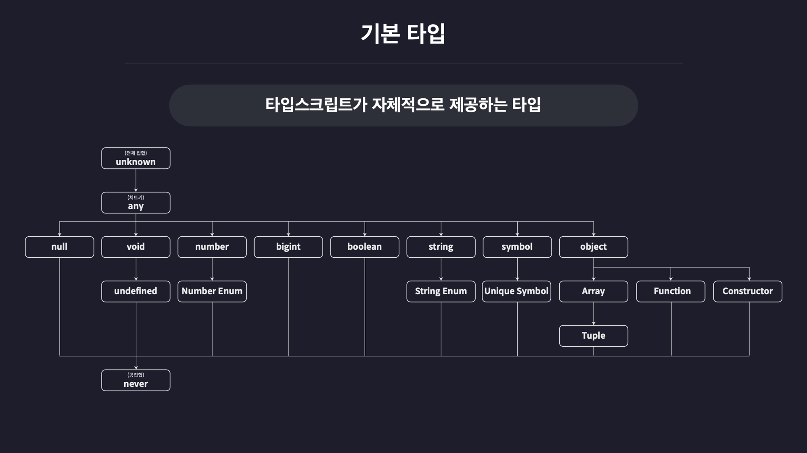

# TS 기본

## 기본 타입이란?

TS에서 자체적으로 제공하는 타입들을 말함.

<figure>
  
  <figcaption>TS 타입 계층도</figcaption>
</figure>

## 원시 타입

*원시 타입(Primitive Type)*은 동시에 한 개의 값만 저장할 수 있는 타입을 말한다.

<br>

예를 들면 원시 타입이 아닌 **배열** 이나 **객체** 같은 비 원시 타입들은 동시에 여러 개의 값들을 저장할 수 있음. 

**number**나 **string**, **boolean** 등의 원시 타입은 숫자면 숫자, 문자열이면 문자열 딱 하나의 값만 저장할 수 있다.

<h3>number</h3>

```ts
// number
let num1: number = 123;
let num2: number = -123;
let num3: number = 0.123;
let num4: number = -0.123;
let num5: number = Infinity;
let num6: number = -Infinity;
let num7: number = NaN;
```

단순 변수 뿐만 아니라 소수, 음수, Infinity. NaN 등의 특수한 숫자들도 포함된다.

변수의 이름 뒤에 콜론(:)과 함께 변수의 타입을 정의하는 것을 *타입 주석*, *타입 어노테이션*, *타입 명시* 라고 부른다.

<br>

<h3>string</h3>

```ts
// string
let str1: string = 'hello';
let str2: string = "hello";
let str3: string = `hello`;
let str4: string = `hello ${str1}`;
```

<br>

<h3>boolean</h3>

```ts
// boolean
let bool1: boolean = true;
let bool1: boolean = false;
```

<br>

<h3>null</h3>

```ts
// null
let null1: null = null;
```

<br>

<h3>undefined</h3>

```ts
// undefined
let undefined1: undefined = undefined;
```

<br>

<h3>null 값을 다른 타입의 변수에 할당하기.</h3>

JS에서는 아직 값이 정해지지 않은 상태에서는 변수에 null을 임시로 넣어두곤 했다.

근데 TS에서는 타입 명시를 했을 경우에 오류가 발생한다

```ts
let numA: number = null; // ❌
```

이럴 때에는 `tsconfig.json`의 `strictNullChecks`를 false로 설정하면 된다

-> 근데 이럴거면 ts 왜 쓰냐

<br>

## 리터럴 타입

TS는 `string`, `number` 처럼 범용적으로 많은 값을 포함할 수 있는 타입뿐 아니라 딱 하나의 값만 포함하는 타입도 존재한다.

```ts
let numA: 10 = 10;
```

변수 `numA`의 탕비을 숫자 10으로 설정했다. 이러면 numA는 10 이외의 값은 지정할 수 없게 된다. (const 아님?)

<br>

## 배열

TS에서 배열을 정의하는 방법은 다음과 같다.

`let numArr: number[] = [1, 2, 3];`

<br>

문자열일 경우는 이런 식

`let strArr: string[] = ['1', '2', '3'];`

<br>

`제네릭`을 사용할 수도 있다.

`let boolArr = Array<boolean> = [true, false, true];`

<h3>다양한 타입 요소를 갖는 배열 타입 정의하기</h3>

`let multiArr: (number | string)[] = [1, 'hello'];`

`|` <- 이건 `유니언`이라고 부름. *또는* 이라고 보면 편함

<br>

<h3>다차원 배열 타입 정의하기</h3>

```ts
let doubleArr: number[][] = [
  [1,2,3],
  [4,5]
];
```

<br>

## 튜플

길이와 타입이 고정된 배열이다.

`let tuple1: [number, number] = [1, 2];`

<br>

다양한 타입을 가질 수도 있다.

`let tuple2: [number, string, boolean]: [1, 'SH', true];`

<br>

<h3>튜플도 배열이다.</h3>

tsc를 사용하여 ts 파일을 컴파일해서 확인해보면 배열로 변환되는 것을 확인할 수 있다.

그러므로 배열 메서드를 이용해 요소를 추가하거나 삭제하는 등의 연산을 할 때에 주의해야한다.

<br>

<h3>튜플을 사용하는 이유</h3>

회원 정보를 2차원 배열로 저장하는 상황을 가정

```ts
const users = [
  ['John', 1],
  ['Michael', 2],
  ['Bob', 3],
]
```

각 배열의 0번 인덱스에는 회원의 이름, 1번 인덱스에는 회원의 아이디를 저장해두었는데 만약 누군가 순서를 잘못 배치하여 요소를 추가할 경우 문제가 생길 수 있다.

```ts
const users = [
  ['John', 1],
  ['Michael', 2],
  ['Bob', 3],
  [4, 'Jane']
]
```

이러면 TS는 바로 화내므로 고친다

<br>

## 객체

<h3>객체 타입을 정의하는 방법</h3>

<h4>1. object로 정의하기</h4>

```ts
let user = {
  id: 1,
  name: '박성현',
}
```

<br>

다음으로 user의 타입을 객체를 의미하는 `object`로 정의한다.

```ts
let user: object = {
  id: 1,
  name: '박성현',
}
```

근데 이런 식으로 하면 문제 생김

`user.id`로 프로퍼티 접근하려 하면

`'object' 타입에 'id' 속성이 없다`고 할 것임...

<br>

이유: ts의 `object` 타입은 단순 값이 객체임을 표헌하는 것 말고는 아무런 정보도 제공하지 않기 떄문. 프로퍼티에 관한 정보는 아무것도 가지고 있지 않다.

<br>

이럴 때엔 `객체 리터럴`을 사용해야 한다.

<h4>2. 객체 리터럴 타입</h4>

```ts
let user: { id: number, name: string} = {
  id: 1,
  name: '박성현'
};
```

변수 user의 타입을 number 타입의 id, string 타입의 name 프로퍼티를 갖는 객체 리터럴 타입으로 정의했다.

<br>

<h3>특수한 프로퍼티 정의하기</h3>

객체 타입을 정의할 때 특정 프로퍼티를 선택적이거나 읽기 전용으로 만드는 TS만의 문법이 있다.

<h4>선택적 프로퍼티(Optional Property)</h4>

키보드를 치다보면 특정 프로퍼티는 있어도 그만 없어도 그만인 경우가 있다.

```ts
let user: { id?: number, name: string } = { name: 홍길동 }
```

이런 식으로 작성한다.

<br>

<h4>읽기전용 프로퍼티(Readonly Property)</h4>

특정 프로퍼티를 읽기 전용으로 만들고 싶을 경우 `readonly` 키워드를 붙인다.

```ts
let user: { id?: number, readonly name: string } = {id: 1, name: '성현' }
```

<br>

## 타입 별칭(Type Alias)

타입 별칭을 이용하면 변수를 설정하듯 타입을 별도로 정의할 수 있다.

```ts
// Type Alias
type User = {
  id: number,
  name: string,
  nickname: string,
  birth: string,
  bio: string,
  location: string,
};

let user: User = {
  id: 1,
  name: '박성현',
  nickname: 'SH',
  birth: '1998-02-08',
  bio: '자기소개입니다.',
  location: '수원시 장안구',
};
```

동일한 스코프에 동일한 이름의 타입 앨리어스를 사용하는 것은 불가능하다.

<br>

## 인덱스 시그니쳐(Index Signiture)

객체 타입을 유연하게 정의할 수 있도록 돕는 특수한 문법이다.

<br>

다양한 국가들의 영어 코드를 저장하는 객체가 있다고 가정한다.

```ts
type CountryCodes = {
  KOR: string,
  US: string,
  UK: string,
}

let countryCodes: CountryCodes = {
  KOR: 'ko',
  US: 'us',
  UK: 'uk',
}
```

만약 이 때 `countryCodes`에 100개의 프로퍼티(국가 코드)가 추가되어야 한다면 타입 정의에도 모두 정의해주어야 하기 때문에 매우 불편할 것

<br>

이럴 때 인덱스 시그니쳐를 사용한다.

```ts
type CountryCodes = {
  [key:string]: string;
}
```

이 객체 타입에는 `key`가 `string` 타입이고 `value`가 `string` 타입인 모든 프로퍼티를 포함한다 라는 의미

반드시 포함해야하는 프로퍼티가 있다면 이런 식으로 표현한다.

```ts
type CountryNumberCodes = {
  [key: string]: string,
  Korea: number;
}
```

<br>

**주의할 점**: 인덱스 시그니쳐를 사용하면서 동시에 추가적인 프로퍼티를 또 정의할 때에는 인덱스 시그니쳐의 value 타입과 직접 추가한 프로퍼티의 `value` 타입이 호환되거나 일치해야 한다. 

따라서 다음과 같이 서로 호환되지 않는 타입으로 설정하면 오류가 발생함

```ts
type CountryNumberCodes = {
  [key: stirng] :number,
  Korea: string, // 오류
}
```

## 열거형(Enum)

JS에서는 존재하지 않고 오직 TS에서만 사용할 수 있음. 여러 개의 값을 나열하는 용도로 사용한다.

```ts
enum Role {
  ADMIN,
  USER,
  GUEST
}
```

<br>

enum의 각 멤버에는 다음과 같이 숫자를 할당할 수 있다. (사실 문자열도 가능)

```ts
enum Role {
  ADMIN = 0,
  USER = 1,
  GUEST = 2,
}
```

enum의 멤버들을 값으로도 활용할 수 있다.

```ts
enum Role {
  ADMIN = 0,
  USER = 1,
  GUEST = 2,
}

const user1 = {
  name: '박성현',
  role: Role.ADMIN, // 관리자, 0
};

const user2 = {
  name: '홍길동',
  role: Role.USER, // 사용자, 1
};

const user3 = {
  name: '고길동',
  role: Role.GUEST, // 게스트, 2
}
```

참고로 enum 멤버에 숫자 값을 직접 할당하지 않아도 0부터 auto increment 됨

첫 값을 따로 지정해뒀다면 거기부터 시작함

## 문자열 열거형

문자열 값도 할당할 수 있다.

```ts
enum Language {
  korean = 'ko',
  english = 'en',
}
```

이런 식이고 숫자형 enum과 똑같이 프로퍼티의 값으로 활용할 수 있다.

<br>

```ts
enum Role {
  ADMIN,
  USER,
  GUEST,
}

enum Language {
  korean = 'ko',
  english = 'en',
}

const user1 = {
  name: '박성현',
  role: Role.ADMIN, // 0
  language: Language.korean, // 'ko'
}
```

오타 발생 가능성 줄인다.

<br>

<h3>enum은 컴파일 결과로 객체가 된다.</h3>

enum은 컴파일될 때 다른 타입들처럼 사라지지 않고 JS의 객체로 변환된다.

```ts
var Role;
(function (Role) {
    Role[Role["ADMIN"] = 0] = "ADMIN";
    Role[Role["USER"] = 1] = "USER";
    Role[Role["GUEST"] = 2] = "GUEST";
})(Role || (Role = {}));
var Language;
(function (Language) {
    Language["korean"] = "ko";
    Language["english"] = "en";
    Language["japanese"] = "jp";
})(Language || (Language = {}));
```

이렇게 생겨먹엇다

<br>

## any

그냥 js랑 다를거 없음 쓰지마셈

<br>

## Unknown

any랑 비슷하지만 안전하다.

지정하면 어떤 값이든 다 저장할 수 있다.

```ts
let unknownVar: unknown;

unknownVar = '';
unknownVar = 1;
unknownVar = () => {};
```

하지만 반대로는 안됨

```ts
let num: number = 10;
(...)

let unknownVar: unknown;

unknownVar = '';
unknownVar = 1;
unknownVar = () => {};

num = unknownVar; // ❌
```

`unknownVar = ~ // OK`<br>
`~ = unknownVar // Error`

<br>

또한 `unknown` 타입의 값은 어떤 연산에도 참여할 수 업스며, 어떤 메서드도 사용할 수 없음

-> 오직 값을 저장하는 행위밖에 할 수 없다.

<br>

굳이 굳이 쓰고 싶다면 이런 식으로 가능

```ts
if (typeof unknownVar === 'number') {
  // 이 조건이 참일 경우 unknownVar는 number
  unknownVar = 2;
}
```

위 코드처럼 조건문을 이용해 특정 값이 특정 타입임을 보장할 수 있게 되면 해당 값의 타입이 자동으로 바뀐다. 이를 타입 좁히기(Narrowing)이라고 함.

<br>

## void

아무런 값도 없음을 의미하는 타입이다.

<br>

보통은 다음과 같이 아무런 값도 반환하지 않는 함수의 반환 값 타입을 정의할 때 사용한다.

```ts
function func2(): void {
  console.log('hello');
}
```

변수의 타입으로도 `void`를 사용할 수 있다. 여기엔 `undefined` 이외의 값은 담을 수 없음

<br>

이유: void 타입이 undefined 타입을 포함하는 타입이기 때문

<br>

`strictNullChecks`를 `false`로 설정할 경우 `null`까지는 담을 수 있다.

```ts
// strictNullChecks: false
let a: void;
a = undefined; // OK
a = null; // OK
```

<br>

## never

불가능을 의미.

보통 다음과 같이 함수가 어떠한 값도 반환할 수 없는 상황일 때 해당 함수의 반환 값 타입을 정의할 때 사용한다.

```ts
function func3(): never {
  while(true) {};
}
```

`func3()`는 무한 루프를 돌기 때문에 아무런 값도 반환할 수 없다. 엄밀히 말하면 이 함수는 영원히 종료될 수 없기 때문에 무언가를 반환한다는 것 자체가 **불가능** 하다

<br>

무한루프 이외에도 의도적으로 오류를 발생시키는 함수도 never 타입으로 반환 값 타입을 정의할 수 있다.

```ts
function func4(): never {
  throw new Error();
}
```

<br>

변수의 타입을 `never`로 정의하면 `any`를 포함해 그 어떠한 타입의 값도 변수에 담을 수 없게 된다.

```ts
let anyVar: any;
(...)

let a: never;
a = 1; // ❌
a = null; // ❌
a = undefined; // ❌
a = anyVar; // ❌
```

싹 다 안된다