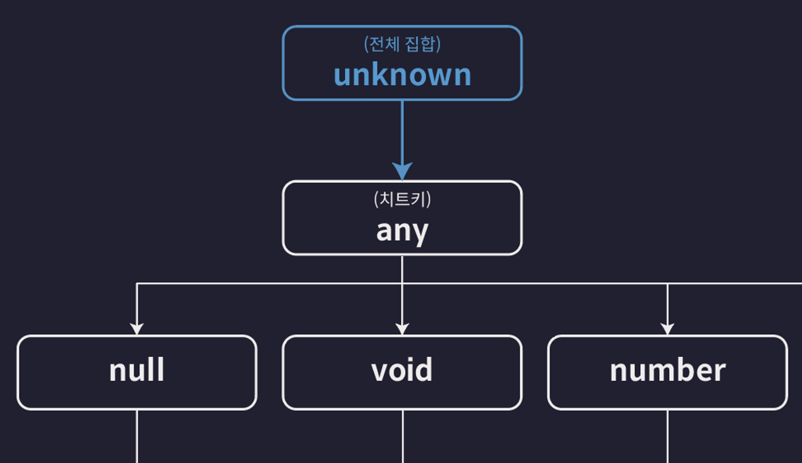

# 타입스크립트 이해하기

## 타입은 집합이다

TS의 '타입'은 사실 여러 개의 값을 포함하는 '집합'이다.

'집합'은 동일한 속성을 갖는 여러 개의 요소들을 하나의 그룹으로 묶은 단위를 말한다.

<figure>
  
  <figcaption>number type set</figcaption>
</figure>

<br>

그렇다면 오직 하나의 값만 포함하는 타입인 Number Literal 타입은 어떤 집합일까?

예를 들어 20이라는 Number Literal 타입이 존재한다면 이 타입은 다음 그림과 같이 딱 하나의 값만 포함하는 아주 작은 집합이라고 볼 수 있다.

<figure>
  
  <figcaption>number literal type set</figcaption>
</figure>

<br>

그리고 이 20이라는 타입에 속하는 요소인 숫자 20은 이 사실 집합 외에도 Number 타입이라는 거대한 집합에도 속한다. 20도 결국 number 이기 떄문

그러므로 모든 Number Literal 타입은 Number 타입이라는 거대한 집합에 포함되는 부분 집합으로 볼 수 있다.

<br>

TS의 모든 타입들은 집합으로써 서로 포함하고 포함되는 관계를 갖는다. 이런 관계에서 Number 타입처럼 다른 타입을 포함하는 타입을 슈퍼(부모) 타입이라고 하고 포함되는 타입은 서브(자식) 타입이라고 한다.

<figure>
  
  <figcaption>number type 계층도</figcaption>
</figure>

맨 처음 [ts-basic](./ts-basic.md)에서 보았던 타입 계층도가 설명해주고 있던 것은 TS가 제공하는 여러가지 기본 타입들간의 집합으로써의 부모-자식 관계인 것임

이를 활용하는 방법을 이제 알아봐야 한다

## 타입 호환성

타입 호환성이란 예를 들어 A와 B 두 개의 타입이 존재할 때 A 타입의 값을 B 타입으로 취급해도 괜찮은 것인지 판단하는 것을 의미한다.

만약 A 타입의 값이 B 타입의 값으로 취급 되어도 괜찮다면 호환이 된다는 것

자바할 때 다형성 말하는듯 업캐스팅 다운캐스팅 개념

<br>

## 기본 타입의 호환성

### unknown (전체 집합)

타입 계층도의 최상단에 위치한다.

<figure>
  
  <figcaption>unknown은 모든 타입의 최상단에 위치한다고</figcaption>
</figure>


따라서 `unknown` 타입 변수에는 모든 타입의 값을 할당할 수 있다 (== 모든 타입은 unknown 타입으로 업캐스트 할 수 있다.)

다운캐스트는 `any`에만 가능하다.

<br>

### never (공집합 타입)

never 타입은 타입 계층도에서 가장 아래에 위치한다.

<figure>
  
  <figcaption>never는 밑바닥에 있다</figcaption>
</figure>

<br>

앞서 `never` 타입은 불가능, 모순을 의미하는 타입이라고 설명한 적 있다.

타입이 집합임을 이해한 지금 `never` 타입을 다시 표현하자면 `never`는 공집합이라고 설명할 수 있다.

따라서 `never`에 해당하는 값은 말 그대로 아무것도 없다.

```ts
function errorFunc(): never {
  throw new Error();
}
```

`errorFunc()`는 에러를 발생시킨다. 따라서 이 함수는 정상적으로 종료되지 않고, 어떠한 값도 반환할 수 없다. 만약 이 함수가 무엇인가를 반환한다면 그것은 모순, 불가능하다.

<br>

또한 공집합은 모든 집합의 부분 집합이다. 그러므로 never 타입은 모든 타입의 서브 타입이다. 따라서 `never` 타입은 모든 타입으로 업캐스팅 할 수 있다.

반면 그 어떤 타입도 `never` 타입으로 다운캐스트 할 수 없다.

<br>

### void

<figure>
  
  <figcaption>계층도에서 void의 위치</figcaption>
</figure>

<br>

`void` 타입은 앞서 다음과 같이 아무것도 반환하지 않는 함수의 반환 값 타입으로 주로 사용된다고 살펴본 적 있다.

```ts
function noReturnFunc(): void {
  console.log('hi');
}
```

타입 계층도에서 void 타입을 찾아보면 void 타입은 undefined 타입의 슈퍼 타입임을 알 수 있다.

-> void로 선언한 함수에서 undefined를 반환해도 오류가 발생하지 않는다.

undefined 타입은 void 타입의 서브 타입이므로 업캐스팅이 가능하다.

<br>

```ts
function noReturnFuncA(): void {
  return undefined;
}

function noReturnFuncB(): void {
  return;
}

function noReturnFuncC(): void {}
```

void 타입의 서브 타입은 `undefined`와 `never` 밖에 없다. 따라서 void 타입에는 undefined, never 외 다른 타입의 값을 할당할 수 없다.

<br>

### any

쓰지마셈

<br>

## 객체 타입의 호환성

모든 객체 타입은 각각 다른 객체 타입들과 슈퍼-서브 타입 관계를 갖는다. 따라서 업 캐스팅은 허용하고 다운 캐스팅은 허용하지 않는다.

```ts
type Animal = {
  name: string,
  color: string,
};

type Dog = {
  name: string,
  color: string,
  breed: string,
};

let animal: Animal = {
  name: '기린',
  color: 'yellow',
};

let dog: Dog = {
  name: '박스훈트',
  color: 'brown',
  breed: '닥스훈트',
};

animal = dog; // OK
dog = animal; // Error
```

`Animal`이 왜 `Dog`의 슈퍼 타입일까?

-> TS는 프로퍼티를 기준으로 타입을 정의하는 구조적 타입 시스템을 따른다고 했음. 

<br>

따라서 `Animal` 타입은 `name`과 `color` 프로퍼티를 갖는 모든 객체들을 포함하는 집합으로 볼 수 있고,

`Dog` 타입은 `name`, `color`, `breed` 프로퍼티를 갖는 모든 객체를 포함하는 집합이라고 볼 수 있다.

그러므모 어떤 객체가 `Dog` 타입이라면 무조건 `Animal`에도 포함된다.

-> `Animal`에게는 `breed`가 없으므로 다운캐스팅할 경우에 문제가 발생하지만 `Dog`는 `Animal`이 갖고있는 모든 프로퍼티가 있기 때문에 업캐스팅을 하더라도 아무 문제가 없다.

<br>

또 다른 예제 ⬇️
```ts
type Book = {
  name: stirng,
  price: number,
};

type ProgrammingBook = {
  name: string,
  price: number,
  skill: string,
};

let book: Book;
let programmingBook: ProgrammingBook = {
  name: '한 입 크기로 잘라먹는 타입스크립트',
  price: 33000,
  skill: 'typescript',
};

book = programmingBook; // OK
promgrammingBook = book; // Error 
```

<h3>초과 프로퍼티 검사</h3>

그런데 이 때 만약 새로운 변수를 만들고 다음과 같이 초깃값을 설정하면 오류가 발생한다.

```ts
type Book = {
  name: string,
  price: number,
};

type ProgrammingBook = {
  name: string,
  price: number,
  skill: string,
};

(...)

let book2: Book = {
  name: '한 입 크기로 잘라먹는 타입스크립트',
  price: 33000,
  skill: 'typescript', //
}
```

`Book` 타입으로 정의된 변수에 `ProgrammingBook` 타입으로 보이는 초깃값을 설정했더니 오류가 발생한다. 업캐스팅에 해당할텐데 왜 이럴까?

결론부터 말하면 `초과 프로퍼티 검사`가 발생한 것

* **초과 프로퍼티 검사**: 변수를 객체 리터럴로 초기화할 때 일어나는 TS의 특수한 기능. 타입에 정의된 프로퍼티 외의 다른 초과된 프로퍼티를 갖는 객체를 변수에 할당할 수 없도록 막는다.

<br>

따라서 위 코드는 `Book` 타입에 정의되지 않은 새로운 `skill`이라는 프로퍼티를 할당하려고 했기 때문에 발생하는 오류

<br>

초과 프로퍼티 검사는 단순히 변수를 초기화할 때 객체 리터럴을 사용하지만 않으면 발생하지 않는다. 값을 다른 변수에 별도로 보관한다음 그 변수를 초기화 값으로 사옹하면 오류가 발생하지 않음

```ts
let book3: Book = programmingBook;

// 함수의 매개 변수에도 동일하게 발생한다.
function func(book: Book){}

func({
  name: '한 입 크기로 잘라먹는 타입스크립트',
  price: 33000,
  skill: 'typescript',
}); // Error
```

함수의 매개 변수에 인수로 값을 전달하는 과정도 변수를 초기화하는 과정과 동일하다

따라서 초과 프로퍼티 검사가 발동하게 됨. 이 때에도 검사를 피하고 싶다면 미리 값을 담아둔 뒤 파라미터로 넘겨주면 됨

<br>

## 대수 타입(Algebraic Type)

여러 개의 타입을 합성해서 만드는 타입을 말한다.

<br>

합집합 타입과 교집합 타입이 존재한다.

합집합은 Union, 교집하븐 Intersection 이라고 부른다.

<br>

### 합집합 타입

다음과 같이 `string`과 `number`의 유니온 타입을 정의할 수 있다. `|`를 이용한다.

```ts
// 합집합 타입 - Union
let a: string | number;
```

이 유니온 타입을 집합으로 표현하면 다음과 같다. 색칠한 범위가 집합에 포함되는 범위.

<figure>
  
  <figcaption>..;;</figcaption>
</figure>

<br>

따라서 이제 변수 a에는 `number` 타입과 `string` 타입에 해당하는 값이라면 뭐든 저장할 수 있다.

```ts
// 합집합 타입 - Union 타입
let a:stirng | number;

a = 1; // OK
a = 'hello'; // OK
```

유니온 타입에 참여하는 타입들의 개수에는 제한이 없다.

`let a: string | number | boolean; // OK`

<h3>Union 타입으로 배열 타입 정의하기</h3>

유니온 타입을 이용하면 다양한 타입의 요소를 보관하는 배열 타입을 손쉽게 정의할 수 있다.

`let arr: (number | string | boolean)[] = [1, 'hello', true];`

<br>

<h3>Union 타입과 객체 타입</h3>

다음과 같이 여러 개의 객체 타입과 유니온 타입도 얼마든지 정의할 수 있다.

```ts
type Dog = {
  name: string,
  color: string,
};

type Person = {
  name: string,
  laguage: string,
};

type Union1 = Dog | Person;
```

이렇게 정의된 Union 타입은 다음과 같이 교집합이 존재하는 두 집합으로 표현할 수 있다.

<figure>
  
  <figcaption>개와 인간의 교집합</figcaption>
</figure>

따라서 다음과 같은 객체들을 포함하는 타입이 된다.

```ts
let union1: Union1 = { // OK
  name: '',
  color: '',
};

let union2: Union1 = { // OK
  name: '',
  language: '',
};

let union3: Union1 = { // OK
  name: '',
  color: '',
  language: '',
};

// 반면에 이런 객체는 포함하지 않는다.

let union4: Union1 = { // Error
  name: '',
};
```

<br>

### 교집합 타입

다음과 같이 `string`과 `number`의 인터섹션 타입을 정의할 수 있다. `&`을 이용한다.

`let variable: number & string; // never 타입으로 추론됨.`

그런데 `number`와 `string`은 서로 교집합을 공유하지 않는 서로소 집합이므로 변수 `variable`은 결국 `never` 타입으로 추론된다.

대다수 기본 타입을 간에는 서로 공유하는 교집합이 없기 때문에 이런 인터섹션 타입은 보통 객체 타입들 간에 더 자주 사용된다.

<h3>Intersection 타입과 객체 타입</h3>

다음은 두 객체 타입의 인터섹션 타입을 정의하는 예이다.

```ts
type Dog = {
  name: string,
  color: string,
};

type Person = {
  name: string,
  language: string,
};

type Intersection = Dog & Person;

let intersection1: Intersection = {
  name: '',
  color: '',
  language: '',
};
```

벤다이어그램으로 표현하면 다음과 같다.

<figure>
  
</figure>

<br>

## 타입 추론

TS는 타입이 정의되어 있지 않은 변수의 타입을 자동으로 추론한다. 이 기능을 `타입 추론`이라고 부른다.

```ts
let a = 10;
// TS가 알아서 number 타입으로 추론해준다.

// 모든 상황에 타입을 잘 추론해주는 것은 아님.
function func(param) { // Error
  (...)
}

// 이렇게 타입 추론이 불가능한 변수(ex. 매개변수)에는 암시적으로 any 타입이 추론된다. strict 모드가 설정되어 있을 경우엔 에러로 취급해버림
```

### 타입 추론이 가능한 상황들


<h3>1. 변수 선언</h3>

일반적인 변수 선언의 경우 초깃값을 기준으로 타입 추론을 잘 한다.

```ts
let a =10; // numeber

let b = 'hello'; // string

let c = { // id, name, profile, url 프로퍼티가 있는 객체 타입으로 추론
  id: 1,
  name: '성현',
  profile: {
    nickname: 'SH',
  },
  url: ['https://shworld.com/'],
};
```

<br>

<h3>2. 구조분해 할당</h3>

객체와 배열을 구조분해 할당 하는 상황에서도 추론을 잘 함

```ts
let { id, name, profile} = c;

let [one, two, three] = [1, 'hello', true];
```

<br>

<h3>3. 함수의 반환 값</h3>

함수 반환 값의 타입은 return 문을 기준으로 잘 추론함

```ts
function func() {
  return 'hello'; // 반환 값을 string으로 잘 추론함
}
```

<br>

<h3>기본 값이 설정된 매개 변수</h3>

기본 값이 설정된 매개 변수의 타입은 기본 값을 기준으로 추론함

```ts
function func(message = 'hello') {
  return 'hello';
}
```

<br>

### 주의해야 할 상황들

<h3>1. 암시적으로 any 타입으로 추론</h3>

변수를 선언할 때 초깃값을 생략하면 암시적인 any 타입으로 추론한다.

이 때 매개 변수의 타입이 암시적 any로 추론될 때와 달리 일반 변수의 타입이 암시적 any로 추론되는 상황은 오류로 판단하지 않는다.

`let d; // 암시적인 any 타입으로 추론`

그리고 이 변수에 값을 할당하면 그 다음 라인부터 any 타입이 해당 값의 타입으로 변한다.

```ts
let d; // any
d = 10; // number
d.toFixed();

d = 'hello'; // string
d.toUpperCase();
d.toFixed(); // Error
```

d = 10; 다음 라인부터 d가 number 타입이 되고, d = 'hello'; 다음 라인부터 d가 string 타입이 된다.

따라서 마지막 라인에 d가 string 타입인데 `toFixed()` 같은 number 타입의 메서드를 사용하려 하면 오류가 발생함.

<br>

<h3>2. const 상수의 추론</h3>

const로 선언된 상수도 타입 추론이 진행된다. 그러나 let으로 선언한 변수와는 다른 방식으로 추론된다.

```ts
const num = 10; // 10 Number Literal 타입으로 추론함.

const str = 'hello'; // 'hello' String Literal 타입으로 추론함.
```

상수는 초기화 때 설정한 값을 변경할 수 없기 때문에 가장 좁은 값으로 추론하게 되는 것

<br>

### 최적 공통 타입(Best Common Type)

다음과 같이 다양한 타입의 요소를 담은 배열을 변수의 초깃값으로 설정하면, 최적의 공통 타입으로 추론된다.

`let arr = [1, 'string]; // (string | number)[] 타입으로 추론함`

<br>

## 타입 단언

아래 코드를 봅시다 ⬇️

```ts
type Person = {
  name: string,
  age: number,
};

let person: Person = {};
person.name = '';
person.age = 23;
```

변수 `person`은 `Person` 타입으로 정의 되었지만 초기화할 때에는 빈 객체를 넣어두고 싶어서 위처럼 작성했다.

그러나 TS는 이런 경우를 허용하지 않는다. `{}`는 `Person` 타입에 해당하지 않기 때문

<br>

이럴 땐 `값 as 타입` 이 빈 객체가 `Person`이라고 TS에게 단언해주면 된다.

```ts
type Person = {
  name: string,
  age: number,
};

let person = {} as Person;
person.name = "";
person.age = 23;
```

<br>

초과 프로퍼티 검사를 피할 때에도 요긴하게 사용할 수 있다.

```ts
type Dog = {
  name: string,
  color: string,
};

let dog: Dog = {
  name: '돌돌이',
  color: 'brown',
  breed: '진도',
} as Dog
```

<h3>타입 단언의 조건</h3>

타입 단언에도 조건은 있다.

`값 as 타입` 형식의 단언식을 `A as B`로 표현했을 때 아래의 두 가지 조건 중 한 가지를 반드시 만족해야 한다.

- A가 B의 슈퍼 타입이다.
- A가 B의 서브 타입이다.

<br>

```ts
let num1 = 10 as never; // OK
let num2 = 10 as unknown; // OK

let num3 = 10 as string; // ❌
```

<br>

<h3>다중 단언</h3>

다중으로도 가능하다. 다중 단언을 사용하면 앞서 살펴본 예제 중 불가능했던 단언을 다음과 같이 가능하도록 만들 수도 있다.

```ts
let num3 = 10 as unknown as string;
```

이런 다중 단언의 경우 왼쪽에서 오른쪽으로 단언이 이루어진다. 따라서 순서대로 살펴보면 다음과 같다.

1. `number` 타입의 값을 `unknown` 타입으로 단언
2. `unknown` 타입의 값을 `string` 타입으로 단언

이렇듯 중간에 값을 `unknown` 타입으로 단언하면 `unknown` 타입은 모든 타입의 슈퍼 타입이므로 모든 타입으로 또 다시 단언하는게 가능하다.

근데 가능만 할 뿐 **쓰지마라**

<br>

### const 단언

타입 단언때에만 사용할 수 있는 `const` 타입이 존재한다. 특정 값을 `const` 타입으로 단언하면 마치 변수를 `const`로 선언한 것과 비슷하게 타입이 변경된다.

```ts
let num4 = 10 as const; // 10 Number Literal 타입으로 단언된다.

let cat = {
  name: '야옹이',
  color: 'yellow',
} as cont; // 모든 property가 readonly를 갖도록 단언됨.
```

<br>

### Non Null 단언

지금까지 살펴본 `값 as 타입` 형태를 따르지 않는 단언

값 뒤에 느낌표(`!`)를 붙여주면 이 값이 undefined 이거나 null이 아닐 것으로 단언할 수 있다.

```ts
type Post = {
  title: string,
  author?: string,
};

let post: Post = {
  title: '게시글1',
};

const len: number = post.author!.length // author가 null, undefined일 수 없을 거라고 보장함
```

<br>

## 타입 좁히기 (Narrowing)

아래와 같은 함수가 있다고 가정

```ts
function func(value: number | string) {}
```

이 때 매개 변수 `value`의 타입이 `number | string` 이므로 함수 내부에서 다음과 같이 value가 number 타입이거나 string 타입일 것으로 기대하고 메서드를 사용하려고 하면 오류가 발생한다.

<br>

```ts
function func(value: number | string) {
  value.toFixed(); // Error
  value.toUpperCase(); // Error
}
```

만약 `value`가 `number` 타입일거라고 기대하고 `toFixed()` 메서드를 사용하고 싶다면 다음과 같이 조건문을 이용해 `value`의 타입이 `number` 임을 보장해야 한다.

<br>

```ts
function func(value: number | string) {
  if(typeof value === 'number') { // number 일 경우 보장
    console.log(value.toFixed());
  } else { // number 아니면 string 이랬음
    console.log(value.toUpperCase);
  }
}
```

`if (typeof ~ === ~)` 처럼 조건문과 함께 사용해 타입을 좁히는 이런 표현들을 `타입 가드`라고 부른다.

<br>

<h3>instanceof 타입가드</h3>

instanceof를 이용하면 내장 클래스 타입을 보장할 수 있는 타입 가드를 만들 수 있다.

```ts
function func(value: number | string | Date | null) {
  if (typof value === 'number') {
    console.log(value.toFixed());
  } else if (typeof value === 'string') {
    console.log(value.toUpperCase());
  } else if (value instanceof Date) {
    console.log(value.getTime());
  }
}
```

`instanceof`는 내장 클래스 또는 직접 만든 클래스에만 사용이 가능한 연산이다. 개발자가 직접 만든 타입과 함께 사용할 수는 없음

<br>

<h3>in 타입 가드</h3>

직접 만든 타입과 함께 사용하려면 다음과 같이 `in` 연산자를 사용해야 한다.

```ts
type Person = {
  name: string,
  age: number,
};

function func(value: number | string | Date | null | Person) {
  if (typeof value === 'number') {
    console.log(value.toFixed());
  } else if (typeof value === 'string') {
    console.log(value.toUpperCase());
  } else if (value instanceof Date) {
    console.log(value.getTime());
  } else if (value && 'age' in value) {
    console.log(`${value.name}은 ${value.age}살 입니다.`);
  }
}
```

<br>

## 서로소 유니온 타입

교집합이 없는 타입들, 즉 서로소 관계에 있는 타입들을 모아 만든 유니온 타입을 말한다.

어따쓰는데 그래서

<br>

```ts
type Admin = {
  name: string,
  kickCount: number,
};

type Member = {
  name: string,
  point: number,
};

type Guest = {
  name: string,
  visitCount: number,
};

type User = Admin | Member | Guest;

function login(user: User) {
  if ('kickCount' in User) {
    // Admin
    console.log(`${user.name}님이 현재까지 추방한 회원 수는 ${user.kickCount}명 입니다`);
  } else if ('point' in user) {
    // Member
    console.log(`${user.name}님은 현재까지 ${user.point} 포인트 모았습니다.`)
  } else {
    // Guest
    console.log(`${user.name}님은 현재까지 ${user.visitCount}번 오셨습니다.`)
  }
}
```

회원의 역할 분류에 따라 3개의 타입을 각각 정의하고, 3개 타입의 합집합 타입인 `User` 타입도 만들어주었다.

<br>

그러나 이렇게 코드를 작성하면 조건식만 보고 어떤 타입으로 좁혀지는지 바로 파악하기 좀 어렵다.

이럴 때에는 각 타입에 태그 프로퍼티를 추가 정의해주면 된다.

```ts
type Admin = {
  tag: 'ADMIN',
  name: string,
  kickCount: number,
};

type Member = {
  tag: 'Member',
  name: string,
  point: number,
};

type Guest = {
  tag: 'Guest',
  name: string,
  visitCount: number,
};

(...)
```

그럼 이제 `login` 함수의 타입 가드를 좀 더 직관적으로 수정할 수 있게 된다.

```ts
function login(user: User) {
  if (user.tag === 'ADMIN') {
    ...
  } else if (user.tag === 'Member') {
    ...
  } else {
    // Guest
    ...
  }
};

// switch를 활용하는 방법도 있디.

function login(user: User) {
  switch(user.tag) {
    case 'ADMIN': {
      (...)
      break;
    }
    case 'MEMBER': {
      (...)
      break;
    }
    case 'GUEST': {
      (...)
      break;
    }
    default: {
      return;
    }
  }
}
```